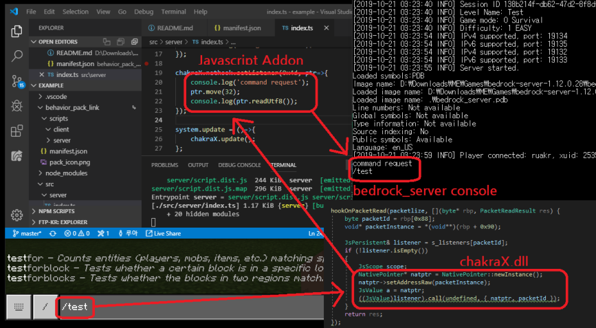

## Bedrock Server X: The Server Modding Project!  
  
**Windows Only**  
It injects more javascript APIs to bedrock_server.exe  
It's very mutable now, I will remove or change API names frequently  

## Install
* Install with NPM  
It needs [NodeJS](https://nodejs.org/)  
Run belows with Command Prompt (You can open Command Prompt with `Windows Key -> cmd -> Enter`)  
```sh
npm i -g bedrock-server-x # install bedrock-server-x
cd path/to/bedrock_server # move to bedrock dedicated server directory
bedrock-server-x # run bedrock-server-x
```
* Install with Binary Release
1. Download [chakraX.zip](https://github.com/karikera/chakraX/releases)
2. Unzip to bedrock_server directory
3. run `bedrock-server-x.bat`

## Scripting in Addon
If it installed correctly, It will print `ChakraX: Attached` at first line in console  
And then You can access `chakraX` global variable in Javascript  

* Use it with Webpack  
It recommends to use Webpack  
[My project starter](https://www.npmjs.com/package/mcaddon-start) can make webpack project easily  
You can import it with webpack from `bedrock-server-x` package  

## Example
```ts
// import {chakraX} from 'bedrock-server-x'; // Only for Webpack
// import NativeFile = chakraX.NativeFile; // typescript
const NativeFile = chakraX.NativeFile; // javascript

chakraX.nethook.setOnPacketAfterListener(1, (ptr, networkIdentifier, packetId, info)=>{
    console.log(`${info.id}> Logined`);
    console.log(`${info.id}> XUID = ${info.xuid}`);
    console.log(`${info.id}> IP = ${info.ip}`);
    const file = new NativeFile('loginlog.txt', NativeFile.WRITE, NativeFile.CREATE_ALWAYS);
    file.write(-1, `${new Date}> ${info.id} logined (IP=${info.ip})`, err => {});
    file.close();
});
```

## JS API Reference
```ts

namespace chakraX
{
    /**
	 * Catch global errors
	 * default error printing is disabled if cb returns false
	 */
    function setOnErrorListener(cb:(err:Error)=>void|boolean): void;

    /**
     * Request native debugger
     */
    function debug():void;

    /**
     * Native console object
     */
    const console:{
        /**
         * print message to console
         */
        log(message:string):void;
        /**
         * set text color
         * @param color color bit flags, You can composite like console.FOREGROUND_BLUE | console.FOREGROUND_RED
         */
        setTextAttribute(color:number):void;
        /**
         * get text color
         */
        readonly FOREGROUND_BLUE:number;
        readonly FOREGROUND_GREEN:number;
        readonly FOREGROUND_RED:number;
        readonly FOREGROUND_INTENSITY:number;
        readonly BACKGROUND_BLUE:number;
        readonly BACKGROUND_GREEN:number;
        readonly BACKGROUND_RED:number;
        readonly BACKGROUND_INTENSITY:number;
    };

    /**
     * Native file, It will open file with CreateFile WinAPI function
     * Must be closed
     */
    class NativeFile
    {
        /**
         * @param path file path
         * @param access bit flags, NativeFile.WRITE or NativeFile.READ
         * @param creation NativeFile.CREATE_NEW or NativeFile.CREATE_ALWAYS or NativeFile.OPEN_EXISTING or NativFile.OPEN_ALWAYS
         */
        constructor(path:string, access:number, creation:number);
        /**
         * NativeFile must be closed after used
         */
        close(): void;
        /**
         * Read as buffer
         * @param offset position from begin of file
         * @param size reading size
         * @param callback callback, error is zero if succeeded
         * @param buffer true = result is buffer, false = result is string
         */
        read(offset:number, size:number, callback:(error:number, buffer:Uint8Array)=>void, buffer:true):void;
        /**
         * Read as string
         * @param offset position from begin of file
         * @param size reading size
         * @param callback callback, error is zero if succeeded
         * @param buffer true = result is buffer, false = result is string
         */
        read(offset:number, size:number, callback:(error:number, buffer:string, bytes:number)=>void, buffer:false):void;
        /**
         * Write file
         * @param offset position from begin of file
         * @param buffer buffer for writing
         * @param callback callback, error is zero if succeeded
         */
        write(offset:number, buffer:string|ArrayBuffer|ArrayBufferView|DataView, callback:(error:number, bytes:number)=>void):void;
        close():void;

        static readonly WRITE:number;
        static readonly READ:number;
        static readonly CREATE_NEW:number;
        static readonly CREATE_ALWAYS:number;
        static readonly OPEN_EXISTING:number;
        static readonly OPEN_ALWAYS:number;
    }

    /**
     * for packet listening
     */
    const nethook: {
        /**
         * @param packetId Listening packetId, I refer to this document: https://github.com/NiclasOlofsson/MiNET/blob/master/src/MiNET/MiNET/Net/MCPE%20Protocol%20Documentation.md
         * @param listener Callback function, ptr is native pointer of a parsed packet, 
         * Maybe you cannot find any document about the parsed packet structure
         * Just Read It and Print It!
         */
        setOnPacketReadListener(packetId: number, listener: (ptr: NativePointer, networkIdentifier: string, packetId: number) => void | boolean): void;
        setOnPacketAfterListener(packetId: number, listener: (ptr: NativePointer, networkIdentifier: string, packetId: number) => void | boolean): void;
        setOnPacketAfterListener(packetId: 1, listener: (ptr: NativePointer, networkIdentifier: string, packetId: number, loginInfo: { id: string, ip: string, xuid: string }) => void | boolean): void;
        setOnConnectionClosedListener(listener: (networkIdentifier: string)=>void):void;
    };

    /**
     * for access native pointer
     */
    class NativePointer
    {
        setAddress(lowBits:number, highBits:number):void;
        move(lowBits: number, highBits?: number): void;
        readUint8():number;
        readUint16():number;
        readUint32():number;
        readInt8():number;
        readInt16():number;
        readInt32():number;
        readPointer():NativePointer;

        /**
         * @param bytes if it's not provided, It will read until reach null character
         */
        readUtf8(bytes?:number):string;
        readBuffer(bytes:number):Uint8Array;
    }

}

namespace fs
{
	function writeFile(path: string, content: string): Promise<void>;
	function readFile(path: string): Promise<string>;
}

```
